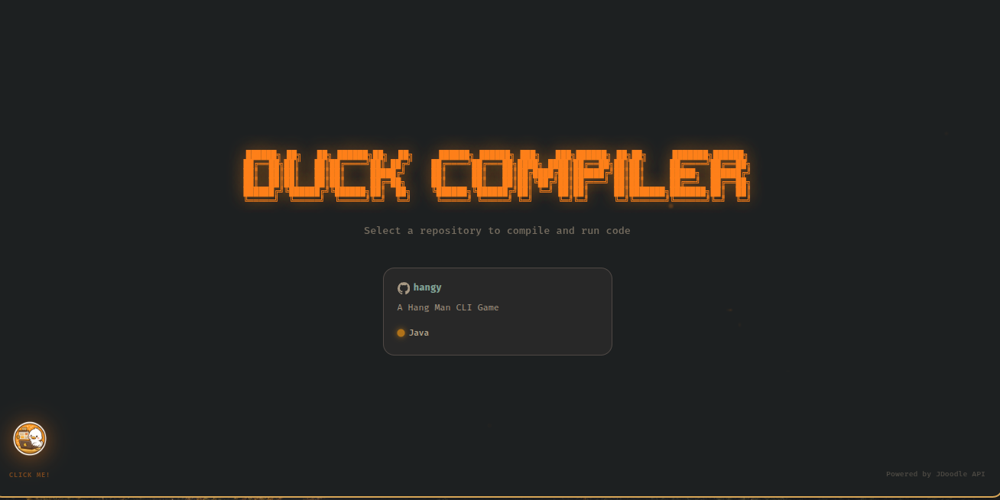
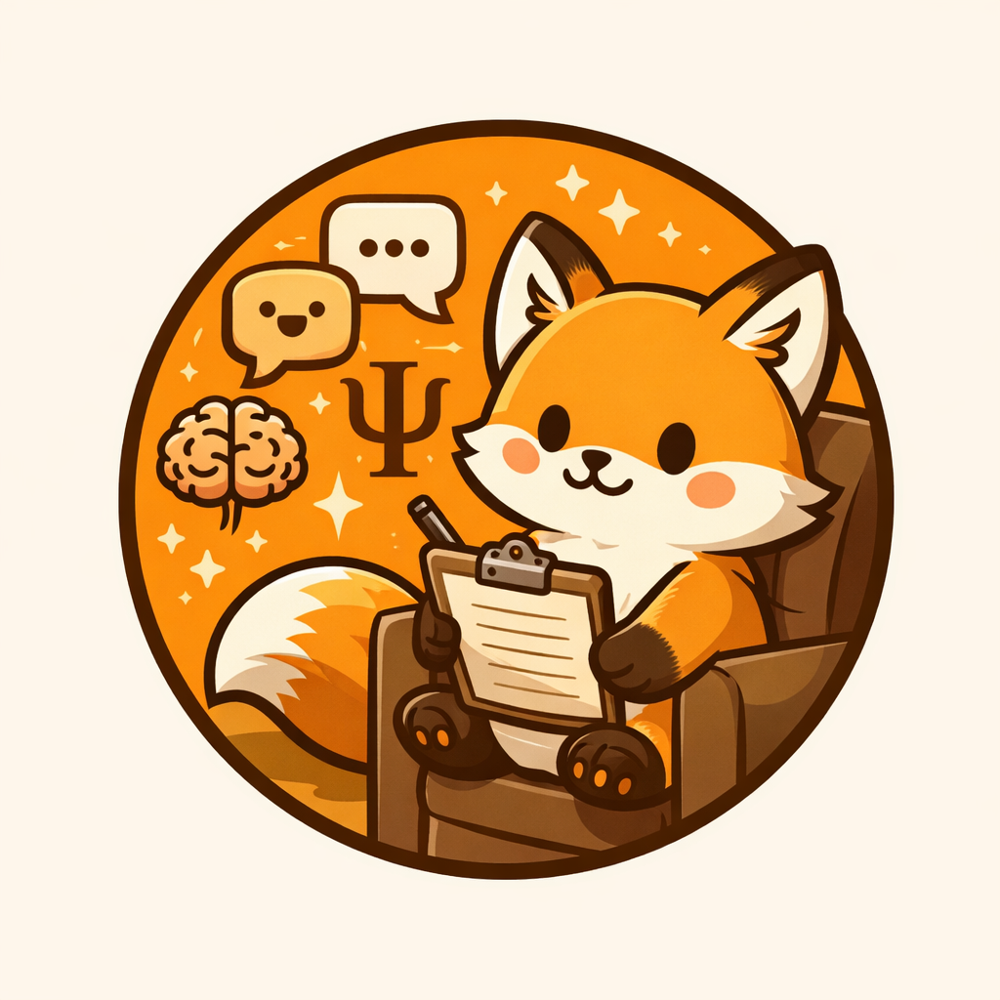

<div align="center">

```
                        ██████╗  █████╗ ██╗  ██╗ ██████╗ █████╗ ████████╗███████╗
                        ██╔══██╗██╔══██╗██║  ██║██╔════╝██╔══██╗╚══██╔══╝██╔════╝
                      ██████╔╝███████║███████║██║     ███████║   ██║   █████╗
                      ██╔══██╗██╔══██║██╔══██║██║     ██╔══██║   ██║   ██╔══╝
                        ██████╔╝██║  ██║██║  ██║╚██████╗██║  ██║   ██║   ███████╗
                        ╚═════╝ ╚═╝  ╚═╝╚═╝  ╚═╝ ╚═════╝╚═╝  ╚═╝   ╚═╝   ╚══════╝
```

</div>

<h3 align="center">🦆 quack quack... hello there, friend!</h3>

---

## About Me

Hi! I'm just a little duck who loves to code!

I waddle through lines of code, splash around in repositories, and leave tiny webbed footprints across the digital pond. By day, I'm your average duck doing duck things. By night? A mysterious developer sharing projects anonymously on **Threads**.

Why anonymous? Well, ducks are naturally shy creatures. We prefer our work to speak louder than our quacks!

```
       __
     >(o )___
      ( ._> /
       `---'   ~ just a duck, coding away ~
```

## What You'll Find Here

All repositories here will be **open source** and free for everyone! I believe code should flow freely, just like a peaceful stream where ducks love to swim.


## Some can be tested right here on my own web compiler!!! DUCK_COMPILER

[](https://duck-compiler.vercel.app)

## Contributions Welcome!

**Pull Requests** and **collaborations** are more than welcome — they're celebrated with happy quacks!

Whether you want to:
- 🐛 Fix a bug
- ✨ Add a new feature
- 📝 Improve documentation
- 💡 Share ideas

...please feel free to contribute! Every little help makes this duck's heart warm and fuzzy.

```
  _      _      _
>(.)__ <(.)__ =(.)__
 (___/  (___/  (___/    ~ let's build together! ~
```

## Find Me

🧵 **Threads**: [@bahcate_dev](https://www.threads.com/@bahcate_dev) — Follow my anonymous quacks and project updates!

## Thanks To

<p align="center">
  
</p>

<p align="center">
  <i>None of this would be possible without my beautiful little fox. Thank you, my dear! 🦊💛</i>
</p>

---

<p align="center">
  <i>made with 💛 and lots of bread crumbs</i>
</p>

<p align="center">
  <code>quack quack, happy coding! 🦆</code>
</p>
